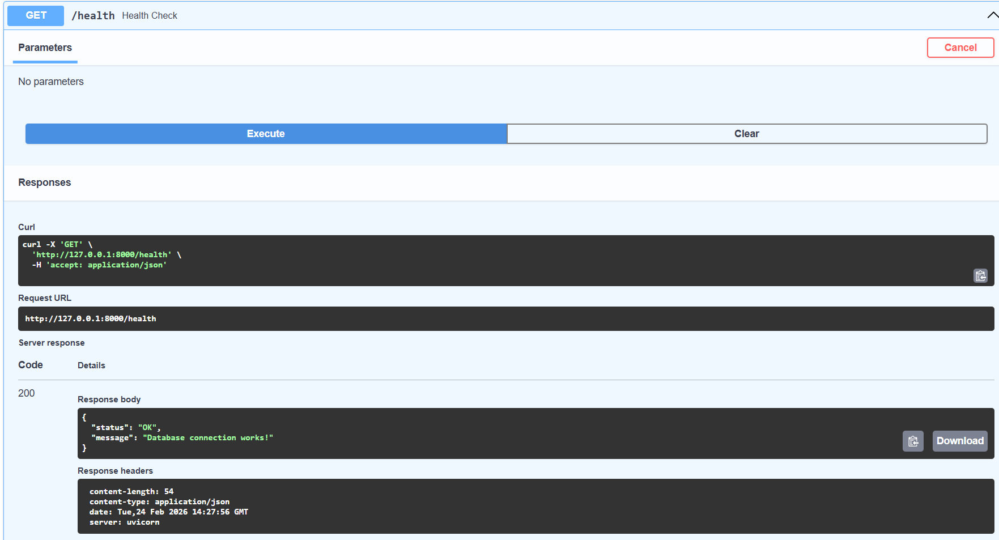
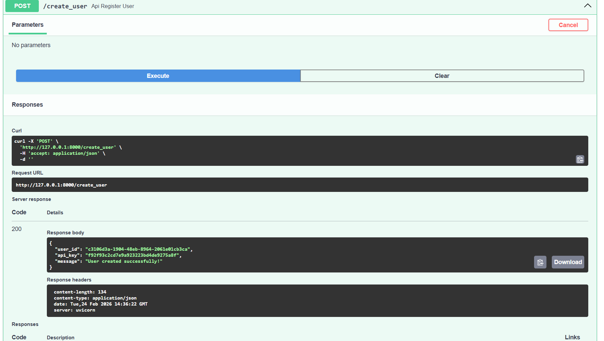
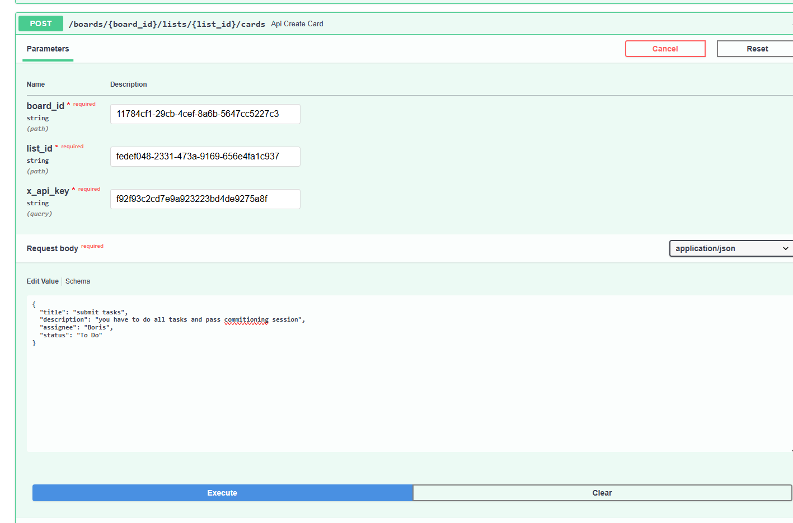

# Mini Kanban API

This is REST API for managing boards, lists and cards (similar with Trello). Project was written with FastAPI.  In the second part of the project, the data storage was migrated from JSON files to a PostgreSQL relational database, and the application was packaged in Docker.

## Technologies
* Database: **PostgreSQL 15**
* Backend: **FastAPI** + **Uvicorn**
* ORM: **SQLAlchemy**
* Infrastructure: **Docker** and **Docker Compose**

## How to run a project

You don't need to install Python or PostgreSQL on your computer. Docker is sufficient.

1. Clone the repository (or unzip the archive) and navigate to the project folder.
2. In the terminal, run the command:
   ```bash
   docker compose up --build
   ```
## Description API (Endpoints) (to see Images press Ctrl+K, then V(in vs code))
* `GET /health` check db

* `POST /create_user` — Create new user and return X-API-Key.

* `GET /boards` — Ge t all user's boards.
* `POST /boards` — Create new board.
* `POST /boards/{board_id}/lists` — Create new list in board.
* `POST /boards/{board_id}/lists/{list_id}/cards` — Create new card in list.

* `GET /boards/{board_id}/lists/{list_id}/cards` — Get cards (There are two filters: status и assignee).
* `PUT /boards/{board_id}/cards/{card_id}/move` — move card from one list to other.

**Autorization:** All endpoints require `x_api_key` parameter.

## Participants
* Mozzhukhin Egor